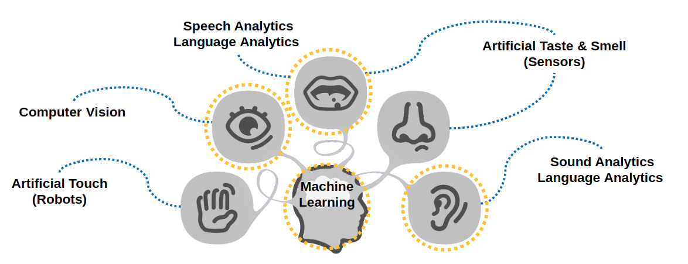
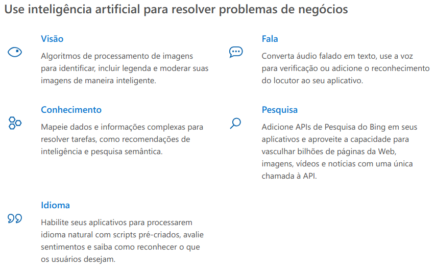

## Desenvolvendo chatbots inteligentes com serviços cognitivos

Luiz Pereira de Souza Filho

https://educ.luizsouza.com.br/apresentacoes/desenvolvendo-chatbots-inteligentes-com-servicos-cognitivos/

---

# Agenda

--

- Palestrante
- Inteligência artificial
    - Aprendizado de máquina
    - Aprendizado profundo
    - Computação cognitiva
- Chatbot
- Serviços cognitivos
- Chatbot na prática

---

# Palestrante

--

Luiz Pereira de Souza Filho, 37 anos

Tecnólogo em Segurança da Informação (Unisinos, 2018)

Na TI desde 1997, desde engenharia de redes a desenvolvimento de sistemas (**devops na veia**)!

Professor de ensino técnico (informática) desde 2012!

Trabalho:

- Cloud Engineer na **Umbler**
- Professor na **IENH**
- Consultor e desenvolvedor freelancer

---

# Inteligência artificial

--

É a inteligência **similar** à humana executada por um programa.

--

## Inteligência

--

1. faculdade de conhecer, compreender e aprender.
1. capacidade de compreender e resolver novos problemas e conflitos e de adaptar-se a novas situações.

---

# Aprendizado de máquina

--

É um ramo de **inteligência artifical** que estuda padrões e teorias de aprendizagem computacional.

---

# Aprendizagem profunda

--

É um ramo de **aprendizado de máquina** que estuda modelos de aprendizagem com algoritmos complexos de representação de dados.

---

# Computação cognitiva

--

É a utilização da **inteligência artificial**, com **aprendizado de máquina** e **aprendizagem profunda** para auxiliar na tomada de decisão humana não supervisionada!

--

---

# Chatbot

--

Robôs de conversa criados auxiliar ou entreter em chats.

--

# Chatbot + IA

--

Robôs de conversa dotados de inteligência para tomadas de decisão sem a supervisão humana.

--

# Tipos de chatbots

--

- Utilitários
- Sociáveis
- Assistente

---

# Porque usar um chatbot?

--

90% do nosso tempo é gasto em plataformas de e-mails e mensagens

---

# Onde usar um chatbot no mercado?

--

## Uso pessoal

--

- Viagens
- Saúde
- Alimentação
- Comunicação
- Diversão
- Compras
- Assistente
- Entretenimento

--

## Assistente em escritórios

--

- Produtividade
- Comunicações
- Analises
- Outras assistências

--

## Negócios Fim a Fim

--

- Recursos Humanos
- Suporte a clientes

---

# IA como serviço

--

- Amazon Web Services (Amazon-AI)
- Google Cloud (Cloud AI)
- Microsoft Azure (Cognitive Services)

--

# Serviços Cognitivos da Azure

--

---

# Brincando com IA como serviço

https://azure.microsoft.com/pt-br/services/cognitive-services/directory/

---

# Jedi Master Bot

https://github.com/lpsouza/jedimasterbot

---

# Duvidas ?

---

# Obrigado!

- lpsouza@gmail.com
- https://about.me/lpsouza
- https://luizsouza.com.br
